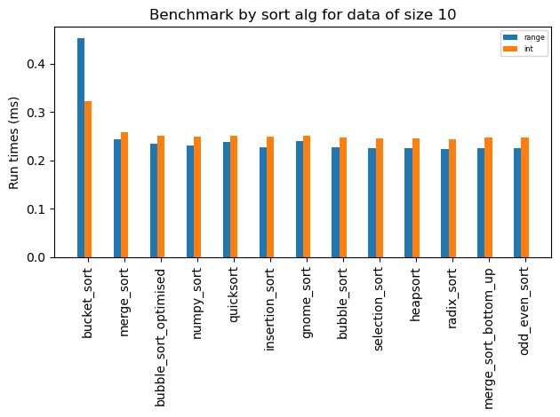
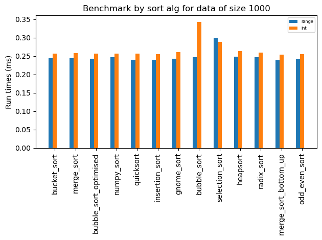
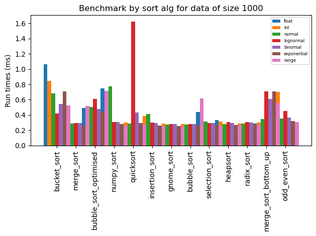
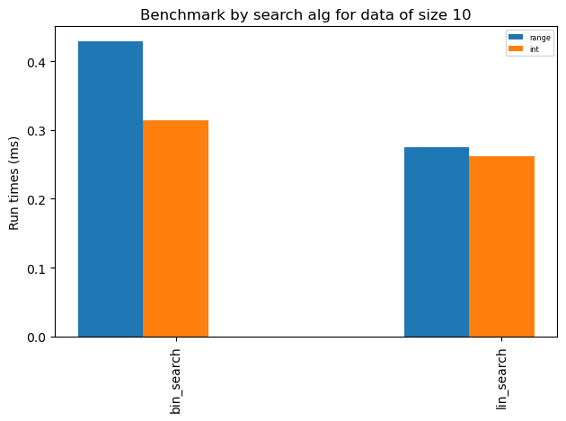

benchmark
================

<!-- WARNING: THIS FILE WAS AUTOGENERATED! DO NOT EDIT! -->

``` python
```

    The autoreload extension is already loaded. To reload it, use:
      %reload_ext autoreload

## Install

``` sh
pip install benchmark
```

## How to use

benchmark sort algorithms in ‘../sort’ folder on arrays of size 10, 100
with data pulled from range and integer based distributions:

``` python
bench.main('../sort', data_sizes=[10, 1000], dist_families=["range","int"])
```





benchmark all distributions

``` python
bench.main('../sort', data_sizes=[10**3])
```



benchmark search algorithms with target=1

``` python
bench.main('../search', data_sizes=[10], dist_families=["range","int"], target=1)
```



``` python
#temp disabled
```
